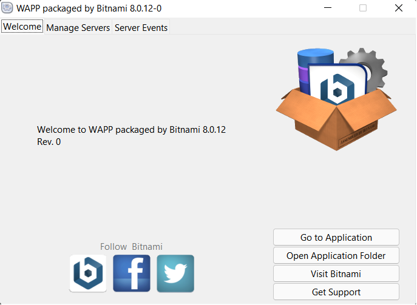
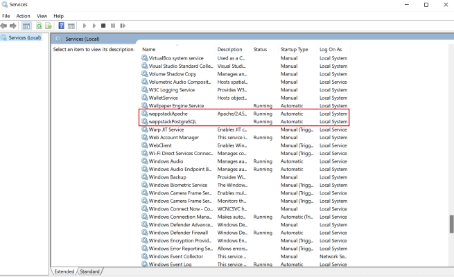
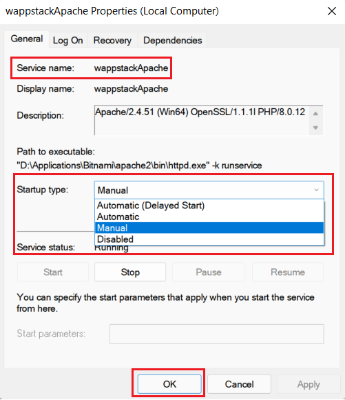

# Recipe-Central
This is a web app designed for users to be able to create, view, and bookmark recipes.

## Setting Up the Local Testing Environment
**WAPP** is a web development stack for **W**indows that includes **A**pache, **P**HP, and **P**ostgreSQL.

### Installation
Installer: https://bitnami.com/stack/wapp

1. We do _not_ need any of the extra components such as Zend Framework, Symfony, CodeIgniter, etc.
You can clear all the optional components that it provides.


2. _**Pay attention**_ to the path of the installation folder so that you can make 
changes to the configuration files.


3. Note the Apache web server port.


4. Create a postgres user password which you will be using to connect to the database.


5. You do _not_ have to launch the wappstack in the cloud with Bitnami, so you can unselect the checkbox.


### Viewing the Application
To view the web app, first make sure Apache is running. You can see the status of Apache and Postgres
by running the installed manager tool. You can find it by using the Windows search bar and typing 
`WAPP packaged by Bitnami Manager Tool`. The _Manage Servers_ tab will show you the status 
and allow you to start or stop the servers.



After verifying that Apache is running, open a web browser and enter `localhost:PORT`, where PORT is the 
Apache web server port you picked during the installation. In my case I used the default
port 81, so it would be `localhost:81` or `127.0.0.1:81`.

By default, the web app will display the files found in *applicationFolder/apache2/htdocs* as that is the 
preconfigured DocumentRoot.


### Updating the DocumentRoot
>DocumentRoot: The directory out of which you will serve your documents.

We should change the path of the DocumentRoot to point to our application. We need to update the paths in two
different files. These files can be found in the installation folder you picked earlier. A quick way to open the
installation folder is through the `WAPP Manager Tool`. On the welcome tab there is a button with a label of 
*Application Folder*. Within that folder edit these files and change the paths of DocumentRoot/Directory to our app:

1. In: .\apache2\conf\httpd.conf
```html
DocumentRoot "D:/Applications/Bitnami/apache2/htdocs"
<Directory "D:/Applications/Bitnami/apache2/htdocs">
```

2. In: .\apache2\conf\bitnami\bitnami.conf
```html

<VirtualHost _default_:81>
    DocumentRoot "D:/Applications/Bitnami/apache2/htdocs"
    <Directory "D:/Applications/Bitnami/apache2/htdocs">
    Options Indexes FollowSymLinks
    AllowOverride All
    <IfVersion < 2.3 >
    Order allow,deny
    Allow from all
    </IfVersion>
    <IfVersion >= 2.3 >
        Require all granted
    </IfVersion>
    </Directory>

    # Error Documents
    ErrorDocument 503 /503.html

    # Bitnami applications installed with a prefix URL (default)
    Include "D:/Applications/Bitnami/apache2/conf/bitnami/bitnami-apps-prefix.conf"
</VirtualHost>
```

Don't forget to restart the Apache server after making these changes.

### Configure Postgresql
The app won't work without a database connection. In `config.php`, set `$dbpass` to your postgresql password
from the installation process. Also make sure that Postgres is running with the `WAPP Manager Tool`.

I've provided an SQL script that generates the necessary tables and fills them with data. 
It can be found in `SQLScripts/fill-database.sql`.


### Auto-Start Services
By default, the Apache Web Server and Postgres will auto-start on startup. 
I recommend changing their startup type to manual, so that you have full control as to when these servers start.

You can edit these services by using the Windows search bar and typing `Services`. 
Within the app find _wappstackApache_ and _wappStackPostgreSQL_. Right-click each service and select 
the “Properties -> Startup Type” field. You might also have _postgresql-x64-14_ in there on auto-start. I recommend
setting that service to manual as well.




